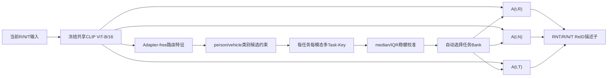

# 无样本重放终身多模态 ReID：两项创新点、理论依据与训练指南

> 文档状态：对应当前 `configs/lifelong/MDReID_TMDA_CSCR.yml` 的主实验实现。  
> 当前主路由为 `LIFELONG.ROUTER.METHOD="task_key"`。配置文件名中保留的
> `CSCR` 是历史命名；早期“跨光谱一致性 + 分类置信度”路由已经降为
> `legacy` 消融，不应再作为论文主方法描述。

## 1. 文档目的

本文面向论文写作和实验复现，详细说明当前系统的两项技术创新：

1. **任务–模态解耦 Adapter Bank（Task–Modality Decoupled Adapter Bank，TMDA）**；
2. **类别感知、稳健校准的多模态 Task-Key 自动路由
   （Category-Aware Calibrated Multi-modal Task-Key Routing，简称可暂定为
   CC-MTKR）**。

两项创新分别处理终身学习中的两个不同问题：

| 问题 | 对应模块 | 主要诊断方式 |
|---|---|---|
| 学习新任务时覆盖旧任务参数 | TMDA | Oracle 路由下的旧任务性能 |
| 测试时不知道应该选择哪个历史专家 | CC-MTKR | Auto 路由准确率、Auto–Oracle 差值 |

一句话概括整个方法：

> 本方法将无样本重放终身多模态 ReID 分解为“知识保持”和“任务推断”两个问题：
> TMDA 通过任务–模态双轴参数隔离控制参数级遗忘，CC-MTKR 在未知数据集身份的
> 条件下自动选择历史 Adapter Bank，以缓解路由级遗忘。

## 2. 理论与原创边界

论文必须区分“已有数学工具”和“本文方法创新”。

### 2.1 不是本文单独发明的技术

以下组件都有成熟理论或相关工作基础，不能单独宣称为原创：

- 瓶颈 Adapter；
- Key–query 相似度选择；
- Log-Sum-Exp（LSE）平滑最大值；
- median（中位数）；
- IQR（四分位距）；
- 使用 median/IQR 的稳健缩放；
- 余弦相似度、间隔损失和多样性正则。

### 2.2 本文应主张的组合创新

本文更合理的创新表述是：

1. 将 Adapter 组织成“任务 × 模态”的二维增量专家库，在一个冻结共享主干上同时处理
   持续任务冲突和 RGB/NIR/TIR 模态冲突；
2. 面向无旧样本、未知任务身份的多模态 ReID，构建“粗粒度类别约束 +
   Adapter-free 多模态 Task-Key + 每任务每模态稳健分数校准”的自动专家选择机制；
3. 将参数级遗忘和路由级遗忘显式拆分，通过 Oracle/Auto 评测分别诊断。

“首个终身多模态 ReID”或“首个统一行人–车辆终身 ReID”是否成立，需要在正式投稿前
通过系统文献检索验证，不能仅凭当前经验直接写成事实。

## 3. 问题定义与实验约束

设数据集按顺序到达：

\[
\mathcal D_1\rightarrow\mathcal D_2\rightarrow\cdots\rightarrow\mathcal D_T.
\]

每个样本包含配准三模态输入：

\[
x=(x_R,x_N,x_T).
\]

学习第 \(t\) 个任务时：

- 只允许访问 \(\mathcal D_t\) 的训练数据；
- 不保存或重放旧训练图像；
- 不保存旧任务逐样本特征；
- 不保存身份原型或生成样本；
- 允许保留模型参数、历史 Adapter、历史 Task-Key 和少量校准统计量；
- 旧任务测试集只能用于阶段性评测，不参与损失计算；
- 每个任务固定训练轮数，不用测试集选择最佳 epoch。

因此本文方法应称为：

```text
exemplar-free / replay-free lifelong learning
```

不应称为：

```text
memory-free lifelong learning
```

因为模型会保留历史参数化知识。

## 4. 总体架构



训练与推理分别执行：

```text
训练：
注册当前任务 → 初始化Adapter与Task-Key → 当前任务训练
→ 拟合当前任务校准统计 → 冻结并保存 → 进入下一任务

推理：
输入类别约束 → Adapter-free特征 → 多Task-Key匹配
→ 每任务分数校准 → 选择Bank → ReID描述子
```

---

# 5. 创新点一：任务–模态解耦 Adapter Bank（TMDA）

## 5.1 研究动机

直接顺序微调整个主干时，新任务梯度会覆盖旧任务参数，造成灾难性遗忘。

若所有任务共享一组 Adapter，虽然主干被冻结，但新任务仍会覆盖旧 Adapter。

若一个任务的 R、N、T 共享完全相同的增量参数，还会混合三种光谱中差异明显的成像
规律。因此当前方法同时沿两个轴解耦：

- **任务轴**：不同数据集使用不同 Adapter Bank；
- **模态轴**：同一任务的 R、N、T 使用三个独立 Adapter。

## 5.2 Adapter 结构

对任务 \(t\) 和模态 \(m\in\{R,N,T\}\)，在每个 Transformer block 中建立
低秩瓶颈 Adapter：

\[
A_{t,m}(h)
=
W^{up}_{t,m}
\sigma\left(W^{down}_{t,m}h\right).
\]

其中：

\[
W^{down}_{t,m}\in\mathbb R^{r\times d},\qquad
W^{up}_{t,m}\in\mathbb R^{d\times r},\qquad r\ll d.
\]

在 Transformer block 中采用并联残差：

\[
h'=h+\operatorname{MSA}(\operatorname{LN}(h)),
\]

\[
h^{out}
=
h'
+\operatorname{MLP}(\operatorname{LN}(h'))
+A_{t,m}(\operatorname{LN}(h')).
\]

当前配置：

```yaml
LIFELONG:
  ADAPTER_RANK: 64
  ADAPTER_DROPOUT: 0.0
```

## 5.3 每个任务的 Adapter Bank

任务 \(t\) 的 Adapter Bank 为：

\[
\mathcal A_t
=
\{A_{t,R},A_{t,N},A_{t,T}\}.
\]

以三个车辆任务为例：

```text
RGBNT100:
  A(rgbnt100,R), A(rgbnt100,N), A(rgbnt100,T)

MSVR310:
  A(msvr310,R), A(msvr310,N), A(msvr310,T)

WMVeID863:
  A(wmveid863,R), A(wmveid863,N), A(wmveid863,T)
```

共享 CLIP 主干始终只有一份，不为每个任务复制完整模型。

## 5.4 冻结与更新规则

学习任务 \(t\) 时：

```text
冻结：
  共享CLIP主干
  全部历史任务Adapter
  全部历史身份分类头
  全部历史Task-Key

更新：
  当前任务R/N/T Adapter
  当前任务身份分类头
  当前任务R/N/T Task-Key
```

因此旧任务的检索参数不会被后续梯度直接覆盖。Oracle 路由用于检查这种参数保护：

- Oracle 稳定、Auto 下降：主要是路由错误；
- Oracle 也下降：需要检查参数冻结、checkpoint 或评测实现。

## 5.5 历史同模态初始化与前向迁移

完全独立的随机 Adapter 虽然能隔离旧知识，但缺少前向迁移。当前默认使用历史同模态
Adapter 均值初始化：

\[
A^{(0)}_{t,m}
=
\frac{1}{t-1}
\sum_{k=1}^{t-1}A_{k,m}.
\]

随后只优化新任务增量：

\[
A_{t,m}=A^{(0)}_{t,m}+\Delta A_{t,m}.
\]

配置：

```yaml
LIFELONG:
  ADAPTER_INIT: "mean"
```

可选：

```text
mean   ：全部历史同模态Adapter均值
latest ：最近一个历史任务的同模态Adapter
zero   ：不复制历史Adapter
```

注意：当前 `mean` 是对全部历史任务的同模态 Adapter 求均值，并未进一步限制为
person/vehicle 同类别。该设置可能造成一定顺序敏感性，应通过 Track A/B/C 和
初始化消融报告。

## 5.6 ReID 训练目标

当前任务的检索表征损失：

\[
\mathcal L_{\mathrm{reid}}
=
\lambda_{id}\mathcal L_{id}
+\lambda_{tri}\mathcal L_{tri}
+\lambda_{con}\mathcal L_{con}.
\]

当前权重：

\[
\lambda_{id}=0.25,\qquad
\lambda_{tri}=1.0,\qquad
\lambda_{con}=0.1.
\]

- \(\mathcal L_{id}\)：R、N、T 身份分类损失；
- \(\mathcal L_{tri}\)：单模态和 RNT 融合 Triplet；
- \(\mathcal L_{con}\)：同一样本三种光谱描述子的余弦一致性。

跨光谱一致性损失仍用于学习 ReID 表征，但在当前主方法中不直接作为自动路由分数。

## 5.7 参数增长

单个含偏置瓶颈 Adapter 的参数量：

\[
P_A=2dr+d+r.
\]

每个任务、三个模态、每层一个 Adapter：

\[
\Delta P_{\mathrm{adapter/task}}
=
3L(2dr+d+r).
\]

CLIP ViT-B/16 中：

\[
d=768,\qquad L=12,\qquad r=64.
\]

得到：

\[
\Delta P_{\mathrm{adapter/task}}
=3,568,896.
\]

约为每任务 3.57M Adapter 参数，另有身份分类头：

\[
P_{\mathrm{head/task}}
=3\times512\times C_t,
\]

其中 \(C_t\) 是当前任务训练身份数。

## 5.8 为什么它属于终身学习

冻结主干并不否定持续学习属性。当前方法属于参数隔离型持续学习，因为：

- 任务顺序到达；
- 旧训练数据不可访问；
- 模型在同一个生命周期内逐步扩展；
- 必须持续保持旧任务能力；
- 自动推理不提供具体数据集 ID；
- 模型容量和历史任务数线性增长并被显式报告。

论文不能声称“固定容量”或“参数完全不增长”，而应强调：

> 相比每个任务复制完整 CLIP，TMDA 以小得多的任务增量参数实现知识隔离。

## 5.9 创新点一的关键消融

至少报告：

1. 顺序微调整个模型；
2. 所有任务共享一组 Adapter；
3. 每任务一个三模态共享 Adapter；
4. 每任务三个模态独立 Adapter（TMDA）；
5. TMDA + Oracle；
6. `ADAPTER_INIT=zero/latest/mean`；
7. `ADAPTER_RANK=16/32/64/128`；
8. 与“每任务保存完整模型”的参数量比较。

---

# 6. 创新点二：类别感知、稳健校准的多模态 Task-Key 路由

## 6.1 研究动机

TMDA 为每个历史任务保留独立专家，但实际推理时不能直接提供数据集 ID。系统必须自动
判断当前样本应该使用哪个历史任务 Bank。

若任务选择错误，即使正确 Adapter 参数完整保留，也会出现性能下降。这种现象称为：

```text
路由级遗忘（routing-induced forgetting）
```

因此第二项创新不是继续保护 Adapter 参数，而是学习一个无旧样本的自动专家选择器。

## 6.2 第一层：类别感知候选约束

任务粗粒度类别：

```text
person:
  RGBNT201
  Market-MM

vehicle:
  RGBNT100
  MSVR310
  WMVeID863
```

输入目标类别 \(c(x)\) 由检测器或数据协议提供，但具体数据集 ID 未知。

类别掩码：

\[
\widetilde S_t(x)
=
\begin{cases}
S_t(x),&c_t=c(x),\\
-\infty,&c_t\neq c(x).
\end{cases}
\]

这一步确定性阻止行人与车辆任务互相抢占，但不能解决 RGBNT100、MSVR310、
WMVeID863 之间的同类别混淆。

## 6.3 Adapter-free 路由特征

对模态 \(m\)：

\[
g_m(x)
=
F_{\mathrm{frozen}}(x_m;\operatorname{task\_adapter=None}).
\]

路由特征经过 L2 归一化：

\[
\bar g_m(x)=\frac{g_m(x)}{\|g_m(x)\|_2}.
\]

使用 Adapter-free 特征的原因：

- 所有候选任务在同一特征空间中公平比较；
- 路由损失不能更新共享主干；
- 避免某个 Adapter 把任意输入强行对齐后获得虚假高分；
- 后续任务不会改变冻结路由特征的定义。

## 6.4 每任务、每模态多 Task-Key

对任务 \(t\) 和模态 \(m\)，维护 \(K\) 个 512 维可学习 Key：

\[
Q_t^m
=
\{q_{t,m,1},\ldots,q_{t,m,K}\}.
\]

当前：

\[
K=4.
\]

因此每个任务不是总共 4 个 Key，而是：

\[
3\times4=12
\]

个 Key。

Key 是模型参数化的域锚点，不是身份原型，也不是永久保存的训练图片。

## 6.5 Task-Key 的生命周期

### 6.5.1 创建

注册新任务时建立参数：

\[
Q_t\in\mathbb R^{3\times K\times512}.
\]

代码先随机分配参数，随后在启用特征初始化时用当前任务的冻结特征覆盖初值。

### 6.5.2 当前任务特征初始化

使用当前任务前若干个确定性 batch，默认：

```yaml
TASK_KEY_INITIALIZATION_BATCHES: 4
```

每个模态分别执行：

1. 选择最接近当前特征均值方向的样本作为第一个 Key；
2. 后续使用最远点策略，选择与已有 Key 集合最不相似的特征；
3. 复制这些特征方向作为 Key 初值；
4. 不保存图片、文件路径或逐样本特征。

初始化后 Key 参与整个当前任务的梯度训练，因此最终 Key 不再等于某几张初始图片的
特征。

### 6.5.3 冻结与保存

当前任务训练结束后：

- 保存最终 Key 参数；
- 拟合并保存三模态校准统计；
- 清除当前任务训练记录；
- 后续阶段冻结该任务 Key。

## 6.6 Key 数量 \(K\)

\(K=4\) 是超参数，不是理论唯一值。配置支持任意正整数：

```yaml
KEYS_PER_MODALITY: 1 / 2 / 4 / 6 / 8
```

每任务 Key 参数量：

\[
\Delta P_{\mathrm{key/task}}=3K\times512.
\]

| \(K\) | 每任务 Key 参数 | FP32 约占用 |
|---:|---:|---:|
| 1 | 1,536 | 6 KB |
| 2 | 3,072 | 12 KB |
| 4 | 6,144 | 24 KB |
| 6 | 9,216 | 36 KB |
| 8 | 12,288 | 48 KB |

权衡：

- \(K\) 太小：难以覆盖数据集内多相机、多场景和多成像风格；
- \(K\) 太大：可能过拟合、Key 重复、路由区域过宽，并增加计算；
- `DIVERSITY_LOSS` 用于抑制多个 Key 塌缩。

正式论文建议消融：

\[
K\in\{1,2,4,8\}.
\]

## 6.7 Log-Sum-Exp 平滑最大值

### 6.7.1 原始余弦匹配

对归一化特征和 Key：

\[
a_{t,m,k}(x)
=
\cos\left(\bar g_m(x),\bar q_{t,m,k}\right).
\]

若直接用硬最大值：

\[
\max_k a_{t,m,k},
\]

只有获胜 Key 获得主要梯度，选择边界不平滑。

### 6.7.2 当前平滑最大公式

\[
s_{t,m}(x)
=
\tau\left[
\log\sum_{k=1}^{K}
\exp\left(\frac{a_{t,m,k}(x)}{\tau}\right)
-\log K
\right].
\]

等价写法：

\[
s_{t,m}(x)
=
\tau\log\left[
\frac1K\sum_{k=1}^{K}
\exp\left(\frac{a_{t,m,k}(x)}{\tau}\right)
\right].
\]

当前：

\[
\tau=0.07.
\]

### 6.7.3 理论界

设：

\[
M=\max_k a_k.
\]

未做 \(-\log K\) 校正的 LSE 满足：

\[
M
\le
\tau\log\sum_k e^{a_k/\tau}
\le
M+\tau\log K.
\]

当前使用 \(-\log K\) 校正后：

\[
M-\tau\log K
\le
s
\le
M.
\]

因此它是最大值的可微近似。

当：

\[
\tau\rightarrow0,
\]

有：

\[
s\rightarrow\max_k a_k.
\]

当 \(\tau\) 很大时，校正后的 log-mean-exp 趋近于普通平均。

其梯度为：

\[
\frac{\partial s}{\partial a_k}
=
\frac{e^{a_k/\tau}}
{\sum_j e^{a_j/\tau}}.
\]

即 softmax 权重。高分 Key 获得更多梯度，但其他 Key 的梯度不严格为零。

### 6.7.4 数值例子

设四个余弦分数：

\[
a=[0.52,0.83,0.61,0.70],\qquad\tau=0.07.
\]

普通平均：

\[
\operatorname{mean}(a)=0.665.
\]

硬最大：

\[
\max(a)=0.83.
\]

取 \(M=0.83\)，稳定计算：

\[
s
=M+\tau\log\left[
\frac14\sum_k e^{(a_k-M)/\tau}
\right].
\]

四个指数项约为：

\[
[0.0119,1,0.0432,0.1561].
\]

于是：

\[
s
=0.83+0.07\log(0.3028)
\approx0.7464.
\]

因此：

```text
普通平均：0.665
平滑最大：0.746
硬最大值：0.830
```

### 6.7.5 理论来源与原创边界

Log-Sum-Exp 是经典的 smooth maximum。Nesterov 系统讨论了显式 max 结构的平滑
优化；在视觉任务中，Pinheiro 和 Collobert 也使用 LSE 聚合替代硬 max，使多个高响应
位置共享梯度。

因此：

> LSE 平滑最大值本身不是本文原创。

本文的设计点是将带 \(\log K\) 校正的 LSE 用于每任务、每模态多 Key 匹配，并把
所得分数接入无重放持续路由。

## 6.8 无重放 Task-Key 路由损失

训练任务 \(t\) 时，路由损失只更新当前 Task-Key：

\[
\mathcal L_{\mathrm{router}}
=
\lambda_p\mathcal L_{\mathrm{pos}}
+\lambda_m\mathcal L_{\mathrm{margin}}
+\lambda_s\mathcal L_{\mathrm{sep}}
+\lambda_d\mathcal L_{\mathrm{div}}.
\]

当前配置：

\[
\lambda_p=1.0,\quad
\lambda_m=1.0,\quad
\lambda_s=0.5,\quad
\lambda_d=0.2.
\]

### 6.8.1 正样本紧致损失

\[
\mathcal L_{\mathrm{pos}}
=
\frac13
\sum_{m\in\{R,N,T\}}
\mathbb E_{x\sim\mathcal D_t}
\left[1-s_{t,m}(x)\right].
\]

作用：

> 让当前任务 Key 与当前任务三模态特征匹配。

### 6.8.2 当前任务对历史任务的间隔损失

对视图：

```text
R、N、T、RNT
```

分别约束：

\[
\mathcal L_{\mathrm{margin}}
=
\mathbb E
\left[
\delta-s_t(x)+
\max_{\substack{j<t\\c_j=c_t}}s_j(x)
\right]_+,
\]

其中：

\[
[z]_+=\max(0,z),\qquad\delta=0.2.
\]

数值例子：

```text
当前MSVR310分数：0.55
旧RGBNT100分数：0.50
要求间隔：0.20
```

\[
\mathcal L_{\mathrm{margin}}
=[0.2-0.55+0.50]_+
=0.15.
\]

作用：

> 对当前新任务样本，新 Key 不仅要匹配，还必须比同类别旧 Key 更合适。

### 6.8.3 任务间 Key 分离损失

\[
\mathcal L_{\mathrm{sep}}
=
\mathbb E_{q_t,q_j}
\left[
\cos(q_t,q_j)-\gamma_{\mathrm{sep}}
\right]_+,
\]

其中：

\[
j<t,\quad c_j=c_t,\quad\gamma_{\mathrm{sep}}=0.2.
\]

作用：

> 从参数几何上避免新旧任务同模态 Key 高度重合。

### 6.8.4 任务内多 Key 多样性损失

\[
\mathcal L_{\mathrm{div}}
=
\mathbb E_{k\neq l}
\left[
\cos(q_{t,m,k},q_{t,m,l})
-\gamma_{\mathrm{div}}
\right]_+,
\]

其中：

\[
\gamma_{\mathrm{div}}=0.2.
\]

作用：

> 防止同一任务、同一模态的 \(K\) 个 Key 全部塌缩到一个方向。

### 6.8.5 为什么需要四项

| 去掉的损失 | 可能退化 |
|---|---|
| \(\mathcal L_{pos}\) | Key 不覆盖当前域 |
| \(\mathcal L_{margin}\) | 当前与历史任务得分不可判别 |
| \(\mathcal L_{sep}\) | 新旧任务 Key 几何重合 |
| \(\mathcal L_{div}\) | 多 Key 退化为重复单 Key |

四项并不自动等于四个独立创新。它们是一个路由目标中的核心项和正则项，必须通过
逐项消融证明必要性。

## 6.9 median/IQR 稳健分数校准

### 6.9.1 为什么需要跨任务校准

不同任务 Key 的原始余弦分数可能具有不同基线和尺度：

```text
任务A自身典型分数：约0.80
任务B自身典型分数：约0.95
```

直接比较原始分数会使任务 B 因“普遍打高分”而持续获胜。

### 6.9.2 median 和 IQR

当前任务 Key 训练结束后，对当前任务确定性训练视图重新计算原始分数。

对任务 \(t\)、模态 \(m\) 的分数集合：

\[
\mathcal S_{t,m}
=
\{s_{t,m}(x_i)\}_{i=1}^{N_t}.
\]

保存：

\[
M_{t,m}
=
\operatorname{median}(\mathcal S_{t,m}),
\]

\[
I_{t,m}
=
Q_{75\%}(\mathcal S_{t,m})
-Q_{25\%}(\mathcal S_{t,m}).
\]

测试时：

\[
\widehat s_{t,m}(x)
=
\frac{s_{t,m}(x)-M_{t,m}}
{\max(I_{t,m},\epsilon)}.
\]

当前：

\[
\epsilon=0.01.
\]

### 6.9.3 理论依据

median 是基于排序的中心位置估计，极端尾部值不会像均值那样直接拉动其数值。

IQR 只使用中间 50% 数据：

\[
IQR=Q_3-Q_1,
\]

是稳健的尺度估计，比标准差更不易受重尾或极端分数影响。

`(x-median)/IQR` 是标准的 robust scaling 形式，主流机器学习工具也采用同样的
“训练集拟合 median/IQR，后续样本使用已保存统计量变换”的流程。

因此：

> median、IQR 和 robust scaling 本身不是本文原创。

本文的设计点是对每个历史任务、每个模态的 Task-Key 自身分数分别拟合稳健尺度，
以便在无旧样本条件下比较不同任务路由分数。

### 6.9.4 校准与梯度训练的关系

当前实现不是联合校准训练，而是：

```text
阶段A：训练Task-Key
  使用未校准原始分数
  calibrated=False
  四项路由损失更新当前Key

阶段B：训练结束后拟合校准
  model.eval()
  torch.no_grad()
  遍历当前任务确定性训练视图
  计算median/IQR
  不执行反向传播

阶段C：自动推理
  calibrated=True
  使用已保存median/IQR转换各任务分数
```

因此不能在论文中写成“median/IQR 参与路由损失的端到端反向传播”。

### 6.9.5 数值例子

测试样本对两个行人任务的原始分数：

```text
RGBNT201：0.84
Market-MM：0.90
```

任务内统计：

```text
RGBNT201 median=0.80, IQR=0.05
Market-MM median=0.92, IQR=0.04
```

校准后：

\[
\widehat s_{\mathrm{RGBNT201}}
=
\frac{0.84-0.80}{0.05}
=0.8,
\]

\[
\widehat s_{\mathrm{Market}}
=
\frac{0.90-0.92}{0.04}
=-0.5.
\]

虽然 Market-MM 原始绝对分数更高，但相对自身典型尺度并不匹配，因此校准后选择
RGBNT201。

### 6.9.6 校准的能力边界

稳健缩放：

- 不会把分数转换成概率；
- 不保证不同任务分布完全相同；
- 不保证消除所有顺序偏置；
- 只使用任务自身分布，不能直接观察新 Key 对旧数据的误响应；
- IQR 很小时可能放大噪声，因此必须使用 \(\epsilon\) 下限。

当前 RGBNT100 被后续车辆任务抢占，说明任务内 robust scaling 能缓解不同原始尺度，
但不能从理论上解决“新 Key 侵入旧任务决策区”的单向学习问题。

## 6.10 多模态融合与自动选择

对可用模态集合 \(\mathcal M\)：

\[
S_t(x)
=
\frac{1}{|\mathcal M|}
\sum_{m\in\mathcal M}\widehat s_{t,m}(x).
\]

因此：

```text
RNT：R/N/T校准分数平均
R：只用R Key
N：只用N Key
T：只用T Key
```

最终：

\[
t^*
=
\arg\max_{t:c_t=c(x)} S_t(x).
\]

选择任务 \(t^*\) 后，使用：

\[
\mathcal A_{t^*}
=
\{A_{t^*,R},A_{t^*,N},A_{t^*,T}\}
\]

生成最终检索描述子。

路由置信间隔：

\[
\operatorname{margin}(x)
=
S_{\mathrm{top1}}(x)-S_{\mathrm{top2}}(x).
\]

间隔越小，说明路由器对前两个候选越犹豫。

## 6.11 参数增长

当前 \(K=4\)、特征维度 512：

\[
\Delta P_{\mathrm{key/task}}
=3\times4\times512
=6144.
\]

另保存：

```text
3个median
3个IQR
1个样本计数
状态标记
```

这些是模型参数或紧凑统计量，不是旧样本 replay buffer。

## 6.12 当前实现暴露的单向约束问题

训练 MSVR310 时可以约束：

\[
S_{\mathrm{MSVR}}(x_{\mathrm{MSVR}})
>
S_{\mathrm{RGBNT100}}(x_{\mathrm{MSVR}})+\delta.
\]

但不能访问旧 RGBNT100 数据，因此不能直接约束：

\[
S_{\mathrm{RGBNT100}}(x_{\mathrm{RGBNT100}})
>
S_{\mathrm{MSVR}}(x_{\mathrm{RGBNT100}})+\delta.
\]

这解释了为什么新任务可以正确识别自身数据，同时仍然抢占旧任务样本。

论文应将当前方法表述为：

> 显著缓解路由遗忘。

在完整车辆实验仍存在混淆时，不应表述为：

> 完全消除路由遗忘。

## 6.13 创新点二的关键消融

至少报告：

1. Oracle task ID；
2. legacy 跨光谱一致性/分类置信度路由；
3. Task-Key，无类别候选约束；
4. 类别感知 + raw Task-Key；
5. 类别感知 + calibrated Task-Key；
6. 去掉特征初始化；
7. \(K=1/2/4/8\)；
8. 去掉 margin；
9. 去掉 separation；
10. 去掉 diversity；
11. \(\tau=0.05/0.07/0.1\)；
12. Auto 与 Oracle 的 mAP 差值；
13. R、N、T、RNT 分模态路由准确率。

---

# 7. 完整联合训练目标

总损失：

\[
\mathcal L
=
0.25\mathcal L_{id}
+1.0\mathcal L_{tri}
+0.1\mathcal L_{con}
+1.0\mathcal L_{router}.
\]

梯度流向：

| 损失 | 主要更新对象 |
|---|---|
| \(\mathcal L_{id}\) | 当前 Adapter、当前身份头 |
| \(\mathcal L_{tri}\) | 当前 Adapter |
| \(\mathcal L_{con}\) | 当前 Adapter |
| \(\mathcal L_{router}\) | 当前 Task-Key |

冻结共享主干不被以上损失更新。

# 8. 训练与推理算法

## 8.1 第 \(t\) 个任务训练

```text
输入：当前任务D_t、冻结共享主干、历史Adapter/Head/Key/校准统计

1. 注册任务t的R/N/T Adapter、身份头和Task-Key
2. 用历史同模态Adapter均值初始化当前Adapter
3. 从当前任务确定性batch提取Adapter-free冻结特征
4. 用均值方向 + 最远点策略初始化当前Task-Key
5. 冻结全部历史参数，只训练当前任务参数
6. 使用ID、Triplet、一致性和四项路由损失训练固定epoch
7. 训练结束后无梯度遍历当前任务，拟合R/N/T median与IQR
8. 保存checkpoint
9. 清除当前训练记录
10. 对所有已见任务执行Auto评测
```

## 8.2 自动推理

```text
输入：未知具体数据集ID的R/N/T样本

1. 获得person/vehicle粗类别
2. 排除不同类别任务
3. 冻结主干提取Adapter-free R/N/T特征
4. 计算每任务每模态的多Key LSE原始分数
5. 使用各任务自身median/IQR校准
6. 对可用模态求平均
7. argmax选择任务Bank
8. 使用选中任务Adapter产生ReID描述子
```

# 9. 实验 Track 与正式指标

## 9.1 Track A

```text
RGBNT201 → Market-MM
```

## 9.2 Track B

```text
RGBNT100 → MSVR310 → WMVeID863
```

## 9.3 Track C grouped

```text
RGBNT201 → Market-MM → RGBNT100 → MSVR310 → WMVeID863
```

## 9.4 Track C interleaved

```text
RGBNT201 → RGBNT100 → Market-MM → MSVR310 → WMVeID863
```

## 9.5 Track C alternate

```text
RGBNT100 → RGBNT201 → MSVR310 → Market-MM → WMVeID863
```

当前正式场景：

```text
RNT→RNT
R→R
N→N
T→T
```

每个场景报告：

```text
mAP、Rank-1、Rank-5、Rank-10、Routing Accuracy
```

持续学习报告：

\[
A_t
=
\frac1t\sum_{j=1}^{t}a_{t,j},
\]

\[
F_t
=
\frac1{t-1}
\sum_{j=1}^{t-1}
\left(
\max_{l<t}a_{l,j}-a_{t,j}
\right).
\]

# 10. Ubuntu 常用训练命令

以下命令均从项目根目录执行：

```bash
cd /workspace/GuangjinOuyang/lifelong-multi-modal
```

统一数据与 CLIP 权重路径：

```text
DATASETS.ROOT_DIR ./dataset
MODEL.PRETRAIN_PATH_T /workspace/GuangjinOuyang/lifelong-multi-modal/data/reid/pretrain_model/ViT-B-16.pt
```

## 10.1 Track A

```bash
CUDA_VISIBLE_DEVICES=2 python train_lifelong.py \
  --config_file configs/lifelong/MDReID_TMDA_CSCR.yml \
  --track A \
  DATASETS.ROOT_DIR ./dataset \
  MODEL.PRETRAIN_PATH_T /workspace/GuangjinOuyang/lifelong-multi-modal/data/reid/pretrain_model/ViT-B-16.pt \
  DATALOADER.NUM_WORKERS 8
```

## 10.2 Track B

```bash
CUDA_VISIBLE_DEVICES=2 python train_lifelong.py \
  --config_file configs/lifelong/MDReID_TMDA_CSCR.yml \
  --track B \
  DATASETS.ROOT_DIR ./dataset \
  MODEL.PRETRAIN_PATH_T /workspace/GuangjinOuyang/lifelong-multi-modal/data/reid/pretrain_model/ViT-B-16.pt \
  DATALOADER.NUM_WORKERS 8
```

## 10.3 Track C grouped

```bash
CUDA_VISIBLE_DEVICES=2 python train_lifelong.py \
  --config_file configs/lifelong/MDReID_TMDA_CSCR.yml \
  --track C \
  --order grouped \
  DATASETS.ROOT_DIR ./dataset \
  MODEL.PRETRAIN_PATH_T /workspace/GuangjinOuyang/lifelong-multi-modal/data/reid/pretrain_model/ViT-B-16.pt \
  DATALOADER.NUM_WORKERS 8
```

## 10.4 Track C interleaved

```bash
CUDA_VISIBLE_DEVICES=2 python train_lifelong.py \
  --config_file configs/lifelong/MDReID_TMDA_CSCR.yml \
  --track C \
  --order interleaved \
  DATASETS.ROOT_DIR ./dataset \
  MODEL.PRETRAIN_PATH_T /workspace/GuangjinOuyang/lifelong-multi-modal/data/reid/pretrain_model/ViT-B-16.pt \
  DATALOADER.NUM_WORKERS 8 \
  OUTPUT_DIR ./outputs/lifelong_task_key_calibrated_interleaved
```

## 10.5 Track C alternate

```bash
CUDA_VISIBLE_DEVICES=2 python train_lifelong.py \
  --config_file configs/lifelong/MDReID_TMDA_CSCR.yml \
  --track C \
  --order alternate \
  DATASETS.ROOT_DIR ./dataset \
  MODEL.PRETRAIN_PATH_T /workspace/GuangjinOuyang/lifelong-multi-modal/data/reid/pretrain_model/ViT-B-16.pt \
  DATALOADER.NUM_WORKERS 8 \
  OUTPUT_DIR ./outputs/lifelong_task_key_calibrated_alternate
```

## 10.6 关闭每5轮中途监控

```bash
CUDA_VISIBLE_DEVICES=2 python train_lifelong.py \
  --config_file configs/lifelong/MDReID_TMDA_CSCR.yml \
  --track C \
  --order grouped \
  DATASETS.ROOT_DIR ./dataset \
  MODEL.PRETRAIN_PATH_T /workspace/GuangjinOuyang/lifelong-multi-modal/data/reid/pretrain_model/ViT-B-16.pt \
  DATALOADER.NUM_WORKERS 8 \
  LIFELONG.PERIODIC_EVAL_PERIOD 0
```

# 11. Ubuntu 常用测试命令

## 11.1 Track C 第五阶段 Auto

```bash
CUDA_VISIBLE_DEVICES=2 python test_lifelong.py \
  --config_file configs/lifelong/MDReID_TMDA_CSCR.yml \
  --checkpoint outputs/lifelong_task_key_calibrated/track_C_grouped/checkpoints/stage_05_wmveid863.pth \
  --routing auto \
  DATASETS.ROOT_DIR ./dataset \
  MODEL.PRETRAIN_PATH_T /workspace/GuangjinOuyang/lifelong-multi-modal/data/reid/pretrain_model/ViT-B-16.pt \
  DATALOADER.NUM_WORKERS 8
```

## 11.2 Track C 第五阶段 Oracle

```bash
CUDA_VISIBLE_DEVICES=2 python test_lifelong.py \
  --config_file configs/lifelong/MDReID_TMDA_CSCR.yml \
  --checkpoint outputs/lifelong_task_key_calibrated/track_C_grouped/checkpoints/stage_05_wmveid863.pth \
  --routing oracle \
  DATASETS.ROOT_DIR ./dataset \
  MODEL.PRETRAIN_PATH_T /workspace/GuangjinOuyang/lifelong-multi-modal/data/reid/pretrain_model/ViT-B-16.pt \
  DATALOADER.NUM_WORKERS 8
```

## 11.3 Track A 第二阶段 Auto

```bash
CUDA_VISIBLE_DEVICES=2 python test_lifelong.py \
  --config_file configs/lifelong/MDReID_TMDA_CSCR.yml \
  --checkpoint outputs/lifelong_task_key_calibrated/track_A_grouped/checkpoints/stage_02_market_mm.pth \
  --routing auto \
  DATASETS.ROOT_DIR ./dataset \
  MODEL.PRETRAIN_PATH_T /workspace/GuangjinOuyang/lifelong-multi-modal/data/reid/pretrain_model/ViT-B-16.pt \
  DATALOADER.NUM_WORKERS 8
```

## 11.4 Track B 第三阶段 Auto

```bash
CUDA_VISIBLE_DEVICES=2 python test_lifelong.py \
  --config_file configs/lifelong/MDReID_TMDA_CSCR.yml \
  --checkpoint outputs/lifelong_task_key_calibrated/track_B_grouped/checkpoints/stage_03_wmveid863.pth \
  --routing auto \
  DATASETS.ROOT_DIR ./dataset \
  MODEL.PRETRAIN_PATH_T /workspace/GuangjinOuyang/lifelong-multi-modal/data/reid/pretrain_model/ViT-B-16.pt \
  DATALOADER.NUM_WORKERS 8
```

## 11.5 只测试 RNT

在测试命令末尾追加：

```bash
LIFELONG.EVAL_SCENARIOS "['RNT']"
```

# 12. 常用消融训练命令

每个消融必须使用不同 `OUTPUT_DIR`，避免覆盖主实验。

## 12.1 Key 数量

### \(K=1\)

```bash
CUDA_VISIBLE_DEVICES=2 python train_lifelong.py \
  --config_file configs/lifelong/MDReID_TMDA_CSCR.yml \
  --track C --order grouped \
  DATASETS.ROOT_DIR ./dataset \
  MODEL.PRETRAIN_PATH_T /workspace/GuangjinOuyang/lifelong-multi-modal/data/reid/pretrain_model/ViT-B-16.pt \
  DATALOADER.NUM_WORKERS 8 \
  LIFELONG.ROUTER.KEYS_PER_MODALITY 1 \
  OUTPUT_DIR ./outputs/ablation_key_k1
```

### \(K=2\)

```bash
CUDA_VISIBLE_DEVICES=2 python train_lifelong.py \
  --config_file configs/lifelong/MDReID_TMDA_CSCR.yml \
  --track C --order grouped \
  DATASETS.ROOT_DIR ./dataset \
  MODEL.PRETRAIN_PATH_T /workspace/GuangjinOuyang/lifelong-multi-modal/data/reid/pretrain_model/ViT-B-16.pt \
  DATALOADER.NUM_WORKERS 8 \
  LIFELONG.ROUTER.KEYS_PER_MODALITY 2 \
  OUTPUT_DIR ./outputs/ablation_key_k2
```

### \(K=8\)

```bash
CUDA_VISIBLE_DEVICES=2 python train_lifelong.py \
  --config_file configs/lifelong/MDReID_TMDA_CSCR.yml \
  --track C --order grouped \
  DATASETS.ROOT_DIR ./dataset \
  MODEL.PRETRAIN_PATH_T /workspace/GuangjinOuyang/lifelong-multi-modal/data/reid/pretrain_model/ViT-B-16.pt \
  DATALOADER.NUM_WORKERS 8 \
  LIFELONG.ROUTER.KEYS_PER_MODALITY 8 \
  OUTPUT_DIR ./outputs/ablation_key_k8
```

## 12.2 关闭稳健分数校准

```bash
CUDA_VISIBLE_DEVICES=2 python train_lifelong.py \
  --config_file configs/lifelong/MDReID_TMDA_CSCR.yml \
  --track C --order grouped \
  DATASETS.ROOT_DIR ./dataset \
  MODEL.PRETRAIN_PATH_T /workspace/GuangjinOuyang/lifelong-multi-modal/data/reid/pretrain_model/ViT-B-16.pt \
  DATALOADER.NUM_WORKERS 8 \
  LIFELONG.ROUTER.TASK_KEY_CALIBRATION False \
  OUTPUT_DIR ./outputs/ablation_no_key_calibration
```

## 12.3 关闭冻结特征初始化

```bash
CUDA_VISIBLE_DEVICES=2 python train_lifelong.py \
  --config_file configs/lifelong/MDReID_TMDA_CSCR.yml \
  --track C --order grouped \
  DATASETS.ROOT_DIR ./dataset \
  MODEL.PRETRAIN_PATH_T /workspace/GuangjinOuyang/lifelong-multi-modal/data/reid/pretrain_model/ViT-B-16.pt \
  DATALOADER.NUM_WORKERS 8 \
  LIFELONG.ROUTER.TASK_KEY_FEATURE_INITIALIZATION False \
  OUTPUT_DIR ./outputs/ablation_random_key_init
```

## 12.4 关闭类别候选约束

```bash
CUDA_VISIBLE_DEVICES=2 python train_lifelong.py \
  --config_file configs/lifelong/MDReID_TMDA_CSCR.yml \
  --track C --order grouped \
  DATASETS.ROOT_DIR ./dataset \
  MODEL.PRETRAIN_PATH_T /workspace/GuangjinOuyang/lifelong-multi-modal/data/reid/pretrain_model/ViT-B-16.pt \
  DATALOADER.NUM_WORKERS 8 \
  LIFELONG.ROUTER.CATEGORY_AWARE False \
  OUTPUT_DIR ./outputs/ablation_no_category_gate
```

## 12.5 Adapter 初始化

### `zero`

```bash
CUDA_VISIBLE_DEVICES=2 python train_lifelong.py \
  --config_file configs/lifelong/MDReID_TMDA_CSCR.yml \
  --track C --order grouped \
  DATASETS.ROOT_DIR ./dataset \
  MODEL.PRETRAIN_PATH_T /workspace/GuangjinOuyang/lifelong-multi-modal/data/reid/pretrain_model/ViT-B-16.pt \
  DATALOADER.NUM_WORKERS 8 \
  LIFELONG.ADAPTER_INIT zero \
  OUTPUT_DIR ./outputs/ablation_adapter_zero
```

### `latest`

```bash
CUDA_VISIBLE_DEVICES=2 python train_lifelong.py \
  --config_file configs/lifelong/MDReID_TMDA_CSCR.yml \
  --track C --order grouped \
  DATASETS.ROOT_DIR ./dataset \
  MODEL.PRETRAIN_PATH_T /workspace/GuangjinOuyang/lifelong-multi-modal/data/reid/pretrain_model/ViT-B-16.pt \
  DATALOADER.NUM_WORKERS 8 \
  LIFELONG.ADAPTER_INIT latest \
  OUTPUT_DIR ./outputs/ablation_adapter_latest
```

## 12.6 Adapter rank

以 rank 32 为例：

```bash
CUDA_VISIBLE_DEVICES=2 python train_lifelong.py \
  --config_file configs/lifelong/MDReID_TMDA_CSCR.yml \
  --track C --order grouped \
  DATASETS.ROOT_DIR ./dataset \
  MODEL.PRETRAIN_PATH_T /workspace/GuangjinOuyang/lifelong-multi-modal/data/reid/pretrain_model/ViT-B-16.pt \
  DATALOADER.NUM_WORKERS 8 \
  LIFELONG.ADAPTER_RANK 32 \
  OUTPUT_DIR ./outputs/ablation_adapter_rank32
```

# 13. Windows 快速调试

Windows PowerShell 只用于代码通路检查，不作为正式论文结果：

```powershell
$env:CUDA_VISIBLE_DEVICES='0'
python train_lifelong.py `
  --config_file configs/lifelong/MDReID_TMDA_CSCR.yml `
  --track A `
  DATASETS.ROOT_DIR ./dataset `
  MODEL.PRETRAIN_PATH_T E:/path/to/ViT-B-16.pt `
  SOLVER.MAX_EPOCHS 1 `
  SOLVER.IMS_PER_BATCH 16 `
  TEST.IMS_PER_BATCH 32 `
  DATALOADER.NUM_WORKERS 0 `
  OUTPUT_DIR ./outputs/windows_smoke_test
```

# 14. 输出文件

以 Track C grouped 为例：

```text
outputs/lifelong_task_key_calibrated/track_C_grouped/
├── checkpoints/
│   ├── stage_01_rgbnt201.pth
│   ├── stage_02_market_mm.pth
│   ├── stage_03_rgbnt100.pth
│   ├── stage_04_msvr310.pth
│   └── stage_05_wmveid863.pth
├── protocols/
│   └── WMVeID863_local-clean-v1.json
├── continual_results.json
├── stage_metrics.csv
├── continual_summary.csv
├── train_log.txt
├── test_auto_stage_05.json
└── test_oracle_stage_05.json
```

# 15. 论文建议表述

## 15.1 创新点一

> 我们提出任务–模态解耦 Adapter Bank，在冻结共享视觉主干的条件下，为每个持续任务
> 和每个光谱模态配置独立的低秩增量专家。该设计通过任务级参数隔离缓解灾难性遗忘，
> 通过模态级专家分解建模 RGB、近红外和热红外之间的成像差异，并使用历史同模态
> Adapter 初始化促进无样本重放条件下的前向迁移。

## 15.2 创新点二

> 我们提出类别感知、稳健校准的多模态 Task-Key 路由。该方法先利用粗粒度目标类别
> 排除语义不相关的历史专家，再在冻结主干的任务无关特征空间中，通过每任务、每模态
> 多中心 Task-Key 建模数据域，并使用任务内 median/IQR 统计统一历史任务匹配分数尺度，
> 从而在不提供具体数据集身份、不重放旧样本的情况下自动选择历史 Adapter Bank。

## 15.3 避免过度表述

当前不建议写：

```text
完全消除灾难性遗忘
完全消除路由错误
固定容量持续学习
完全不保存历史信息
LSE由本文首次提出
median/IQR校准由本文首次提出
```

建议写：

```text
显著缓解参数级遗忘
显著缓解路由级遗忘
参数高效的线性扩展模型
无旧样本重放
将成熟平滑与稳健统计工具用于多模态持续专家路由
```

# 16. 理论和相关方法参考

1. Nesterov, Y. *Smooth minimization of non-smooth functions*.
   Mathematical Programming 103, 127–152 (2005).  
   https://doi.org/10.1007/s10107-004-0552-5

2. Pinheiro, P. O. and Collobert, R. *From Image-Level to Pixel-Level
   Labeling With Convolutional Networks*. CVPR (2015). 该工作使用
   Log-Sum-Exp 聚合替代硬最大聚合。  
   https://openaccess.thecvf.com/content_cvpr_2015/html/Pinheiro_From_Image-Level_to_2015_CVPR_paper.html

3. NIST/SEMATECH e-Handbook, *Measures of Location*. 其中说明 median
   对极端尾部值比 mean 更稳健。  
   https://itl.nist.gov/div898/handbook/eda/section3/eda351.htm

4. NIST/SEMATECH e-Handbook, *Measures of Scale*. 其中将 IQR 定义为
   75% 分位数减 25% 分位数，并讨论其稳健尺度性质。  
   https://itl.nist.gov/div898/handbook/eda/section3/eda356.htm

5. scikit-learn, *RobustScaler*. 官方实现采用“减 median、除以 IQR”，
   并保存训练集统计用于后续样本变换。  
   https://scikit-learn.org/stable/modules/generated/sklearn.preprocessing.RobustScaler.html

6. Wang, Z. et al. *Learning To Prompt for Continual Learning*. CVPR
   (2022). L2P 使用可学习 Key 对 prompt pool 进行实例级选择，并支持测试时
   未知任务身份的持续学习。  
   https://openaccess.thecvf.com/content/CVPR2022/html/Wang_Learning_To_Prompt_for_Continual_Learning_CVPR_2022_paper.html

7. Houlsby, N. et al. *Parameter-Efficient Transfer Learning for NLP*.
   ICML/PMLR (2019). 该工作系统展示了冻结主干、为任务增加少量 Adapter
   参数的参数高效迁移范式。  
   https://proceedings.mlr.press/v97/houlsby19a.html

# 17. 与仓库其他文档的关系

- 总体协议和数据集格式：
  [终身多模态ReID技术设计与实现.md](终身多模态ReID技术设计与实现.md)
- Task-Key 两层路由结构：
  [Task-Key路由改造与验证说明.md](Task-Key路由改造与验证说明.md)
- Task-Key 分数校准：
  [Task-Key分数校准与路由修复说明.md](Task-Key分数校准与路由修复说明.md)
- 单高斯路由备选方案：
  [单高斯域指纹路由实现与运行说明.md](单高斯域指纹路由实现与运行说明.md)

